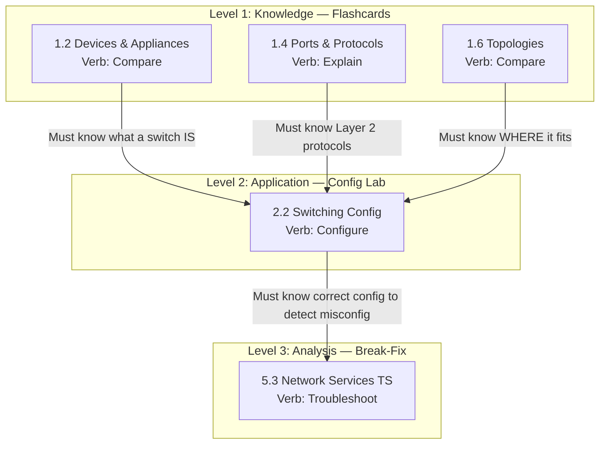
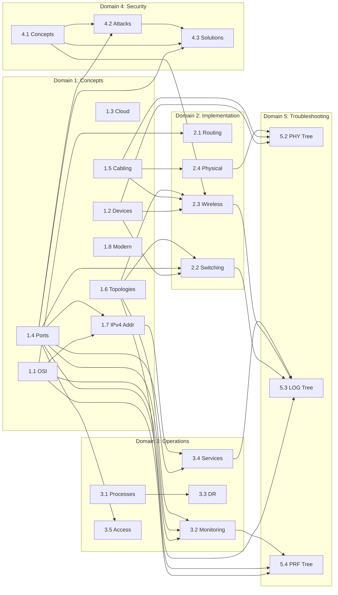
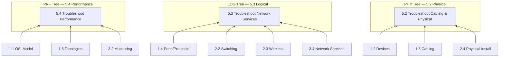
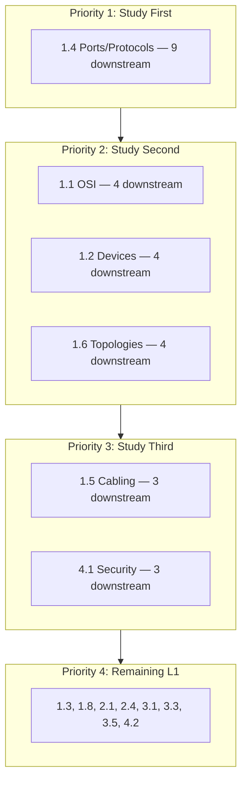

# Skill Trees: Dependency Visualizations

> Mermaid.js diagrams showing the prerequisite chains between N10-009 objectives.

---

## The Switching Skill Tree

The canonical example of how Level 1 knowledge "unlocks" Level 2 skills, which in turn "unlock" Level 3 mastery.

---

## The Complete Dependency DAG

All 25 objectives mapped by skill level and prerequisite chains.

---

## The Three Trees: Convergence View

Shows how Domains 1-4 feed into the three Domain 5 troubleshooting trees.

---

## Study Order Priority

Based on downstream dependency count:

